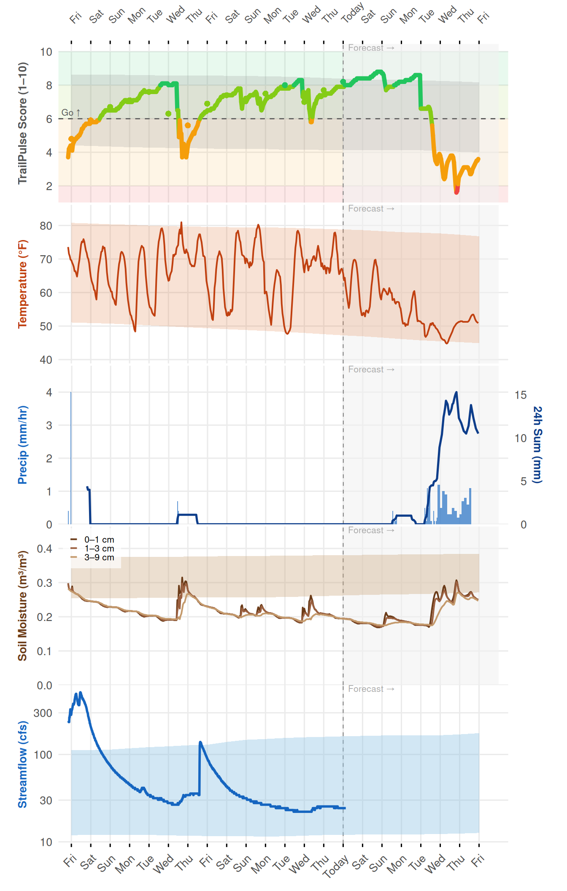
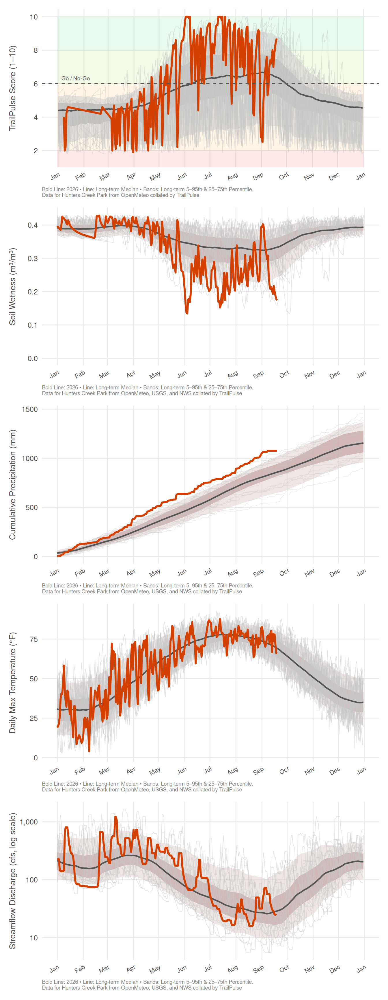
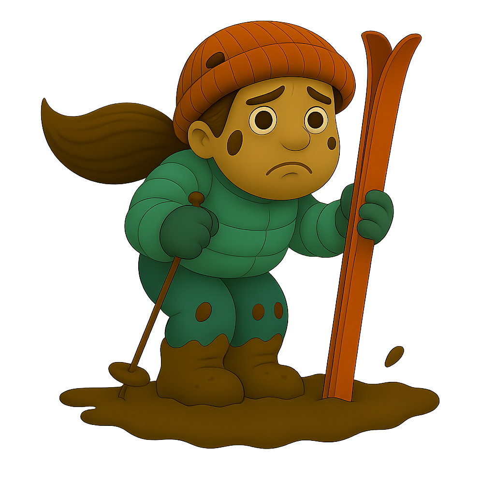
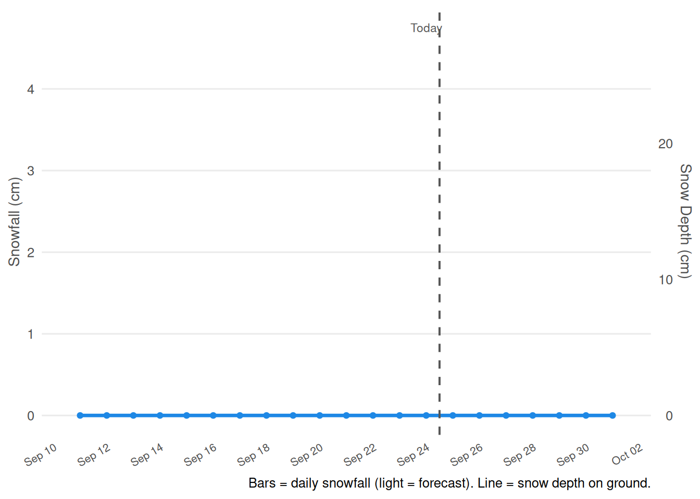
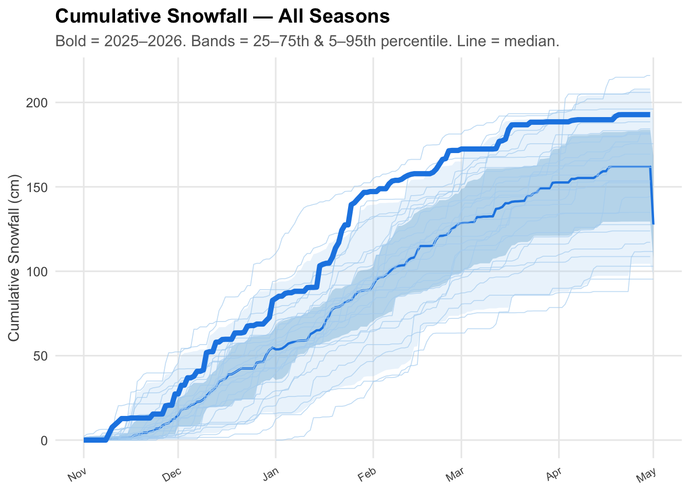
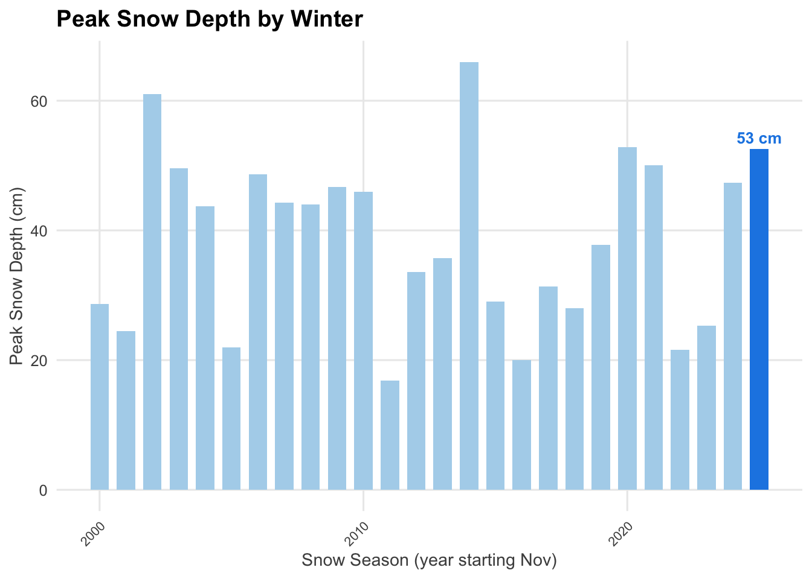

::: {.cell}

:::


::: {.cell}

:::


::: {.callout-note appearance="minimal"}
Last updated: May 15, 2026 at 02:31 PM EDT. Data from [Open-Meteo](https://open-meteo.com), [USGS](https://waterdata.usgs.gov), and [NWS](https://www.weather.gov).
:::

::: {.panel-tabset}

## 🥾 Trail Conditions

<div class="tp-hero"><div class="tp-face"></div><div class="tp-hero-text"><h2 style="margin-top:0">Poor</h2><p style="font-size:1.1rem">Trails are tacky — expect excellent grip, light mud on low sections.</p><div style="display:flex;gap:1.5rem;flex-wrap:wrap;margin-top:0.75rem;"><div class="tp-stat-box"><div class="stat-value">16°C / 61°F</div><div class="stat-label">Today's High</div></div><div class="tp-stat-box"><div class="stat-value">15.4 mm / 0.6 in</div><div class="stat-label">Precip Last 7 Days</div></div><div class="tp-stat-box"><div class="stat-value" style="color:#a06c34">5.1</div><div class="stat-label">Mud Score (0–10)</div></div></div></div></div>

### Current Conditions & Forecast


::: {.cell}
::: {.cell-output-display}
{width=672}
:::
:::


<p><strong>Forecast mud levels:</strong></p>
```{=html}
<div class="tp-forecast-strip">
<div class="tp-forecast-day">
<span class="day-label">Fri</span>

<span class="mud-label">Tacky</span>
</div>
<div class="tp-forecast-day">
<span class="day-label">Sat</span>

<span class="mud-label">Tacky</span>
</div>
<div class="tp-forecast-day">
<span class="day-label">Sun</span>

<span class="mud-label">Tacky</span>
</div>
<div class="tp-forecast-day">
<span class="day-label">Mon</span>

<span class="mud-label">Tacky</span>
</div>
<div class="tp-forecast-day">
<span class="day-label">Tue</span>

<span class="mud-label">Firm</span>
</div>
<div class="tp-forecast-day">
<span class="day-label">Wed</span>

<span class="mud-label">Soft</span>
</div>
<div class="tp-forecast-day">
<span class="day-label">Thu</span>

<span class="mud-label">Firm</span>
</div>
</div>
```


::: {.cell}
::: {.cell-output-display}

```{=html}
<details>
<summary>
<strong>NWS 7-Day Forecast</strong>
</summary>
<div style="margin-top:0.75rem;">
<div class="tp-forecast-strip" style="flex-wrap:wrap; gap:0.75rem">
<div class="nws-forecast-card">
<div class="nws-period-name">This Afternoon</div>

<div class="nws-temp">
62°F
<br/>
17°C
</div>
<div class="nws-wind">12 mph</div>
<div class="nws-desc">Mostly Sunny</div>
</div>
<div class="nws-forecast-card">
<div class="nws-period-name">Saturday</div>

<div class="nws-temp">
77°F
<br/>
25°C
</div>
<div class="nws-precip">💧 39%</div>
<div class="nws-wind">7 to 10 mph</div>
<div class="nws-desc">Mostly Sunny then Slight Chance Showers And Thunderstorms</div>
</div>
<div class="nws-forecast-card">
<div class="nws-period-name">Sunday</div>

<div class="nws-temp">
76°F
<br/>
24°C
</div>
<div class="nws-precip">💧 24%</div>
<div class="nws-wind">3 mph</div>
<div class="nws-desc">Slight Chance Rain Showers then Partly Sunny</div>
</div>
<div class="nws-forecast-card">
<div class="nws-period-name">Monday</div>

<div class="nws-temp">
86°F
<br/>
30°C
</div>
<div class="nws-precip">💧 2%</div>
<div class="nws-wind">7 mph</div>
<div class="nws-desc">Sunny</div>
</div>
<div class="nws-forecast-card">
<div class="nws-period-name">Tuesday</div>

<div class="nws-temp">
83°F
<br/>
28°C
</div>
<div class="nws-precip">💧 29%</div>
<div class="nws-wind">7 to 10 mph</div>
<div class="nws-desc">Slight Chance Rain Showers then Chance Showers And Thunderstorms</div>
</div>
<div class="nws-forecast-card">
<div class="nws-period-name">Wednesday</div>

<div class="nws-temp">
72°F
<br/>
22°C
</div>
<div class="nws-precip">💧 54%</div>
<div class="nws-wind">9 mph</div>
<div class="nws-desc">Chance Rain Showers</div>
</div>
<div class="nws-forecast-card">
<div class="nws-period-name">Thursday</div>

<div class="nws-temp">
63°F
<br/>
17°C
</div>
<div class="nws-precip">💧 11%</div>
<div class="nws-wind">6 mph</div>
<div class="nws-desc">Partly Sunny</div>
</div>
</div>
</div>
</details>
```

:::
:::


---

### Compared to Previous Years

<div class="tp-percentile" style="margin-bottom:1rem;">Year-to-date precipitation is <strong>wetter than 100%</strong> of years since 2000.</div>

#### Historical Conditions — All Years


::: {.cell}
::: {.cell-output-display}
{width=672}
:::
:::


#### Vegetation — NDVI (HLS Landsat + Sentinel-2)


::: {.cell}

:::


## ❄️ Snow & Winter

<div class="tp-hero"><div class="tp-face"></div><div class="tp-hero-text"><h2 style="margin-top:0">Poor</h2><p style="font-size:1.1rem">No snow on the ground currently.</p><div style="display:flex;gap:1.5rem;flex-wrap:wrap;margin-top:0.75rem;"><div class="tp-stat-box"><div class="stat-value">0 cm / 0 in</div><div class="stat-label">Snow Depth Now</div></div><div class="tp-stat-box"><div class="stat-value">193 cm / 76 in</div><div class="stat-label">Season Total</div></div><div class="tp-stat-box"><div class="stat-value">47</div><div class="stat-label">Snow Days</div></div></div></div></div>

### 14-Day Window + 7-Day Forecast


::: {.cell}
::: {.cell-output-display}
{width=672}
:::
:::


<p><strong>Forecast snow conditions:</strong></p>
```{=html}
<div class="tp-forecast-strip">
<div class="tp-forecast-day">
<span class="day-label">Sat</span>

<span class="mud-label">0 cm</span>
</div>
<div class="tp-forecast-day">
<span class="day-label">Sun</span>

<span class="mud-label">0 cm</span>
</div>
<div class="tp-forecast-day">
<span class="day-label">Mon</span>

<span class="mud-label">0 cm</span>
</div>
<div class="tp-forecast-day">
<span class="day-label">Tue</span>

<span class="mud-label">0 cm</span>
</div>
<div class="tp-forecast-day">
<span class="day-label">Wed</span>

<span class="mud-label">0 cm</span>
</div>
<div class="tp-forecast-day">
<span class="day-label">Thu</span>

<span class="mud-label">0 cm</span>
</div>
</div>
```


::: {.cell}
::: {.cell-output-display}

```{=html}
<details>
<summary>
<strong>NWS 7-Day Forecast</strong>
</summary>
<div style="margin-top:0.75rem;">
<div class="tp-forecast-strip" style="flex-wrap:wrap; gap:0.75rem">
<div class="nws-forecast-card">
<div class="nws-period-name">This Afternoon</div>

<div class="nws-temp">
62°F
<br/>
17°C
</div>
<div class="nws-wind">12 mph</div>
<div class="nws-desc">Mostly Sunny</div>
</div>
<div class="nws-forecast-card">
<div class="nws-period-name">Saturday</div>

<div class="nws-temp">
77°F
<br/>
25°C
</div>
<div class="nws-precip">💧 39%</div>
<div class="nws-wind">7 to 10 mph</div>
<div class="nws-desc">Mostly Sunny then Slight Chance Showers And Thunderstorms</div>
</div>
<div class="nws-forecast-card">
<div class="nws-period-name">Sunday</div>

<div class="nws-temp">
76°F
<br/>
24°C
</div>
<div class="nws-precip">💧 24%</div>
<div class="nws-wind">3 mph</div>
<div class="nws-desc">Slight Chance Rain Showers then Partly Sunny</div>
</div>
<div class="nws-forecast-card">
<div class="nws-period-name">Monday</div>

<div class="nws-temp">
86°F
<br/>
30°C
</div>
<div class="nws-precip">💧 2%</div>
<div class="nws-wind">7 mph</div>
<div class="nws-desc">Sunny</div>
</div>
<div class="nws-forecast-card">
<div class="nws-period-name">Tuesday</div>

<div class="nws-temp">
83°F
<br/>
28°C
</div>
<div class="nws-precip">💧 29%</div>
<div class="nws-wind">7 to 10 mph</div>
<div class="nws-desc">Slight Chance Rain Showers then Chance Showers And Thunderstorms</div>
</div>
<div class="nws-forecast-card">
<div class="nws-period-name">Wednesday</div>

<div class="nws-temp">
72°F
<br/>
22°C
</div>
<div class="nws-precip">💧 54%</div>
<div class="nws-wind">9 mph</div>
<div class="nws-desc">Chance Rain Showers</div>
</div>
<div class="nws-forecast-card">
<div class="nws-period-name">Thursday</div>

<div class="nws-temp">
63°F
<br/>
17°C
</div>
<div class="nws-precip">💧 11%</div>
<div class="nws-wind">6 mph</div>
<div class="nws-desc">Partly Sunny</div>
</div>
</div>
</div>
</details>
```

:::
:::


---

### Compared to Previous Winters

<div class="tp-percentile" style="margin-bottom:1rem;">This season has been <strong>snowier than 81%</strong> of winters since 2000.</div>

#### Cumulative Snowfall — All Seasons


::: {.cell}
::: {.cell-output-display}
{width=672}
:::
:::


#### Peak Snow Depth by Winter


::: {.cell}
::: {.cell-output-display}
{width=672}
:::
:::


:::

---

::: {.callout-tip collapse="true"}
### About the Mud Model

Trail muddiness is estimated using a weighted average of soil moisture in the top 9 cm
(ERA5-Land reanalysis for history, Open-Meteo forecast model for future days).
A logistic sigmoid maps soil wetness (0–0.6 m³/m³) to a 0–10 mud score.
An additional boost is applied when precipitation exceeds 5 mm in the prior 24 hours.
When surface temperature is below 0°C the trail surface is flagged as **Frozen**.

The model has not been calibrated against field observations at this location —
treat mud scores as estimates, especially near the boundaries between named levels.
:::


